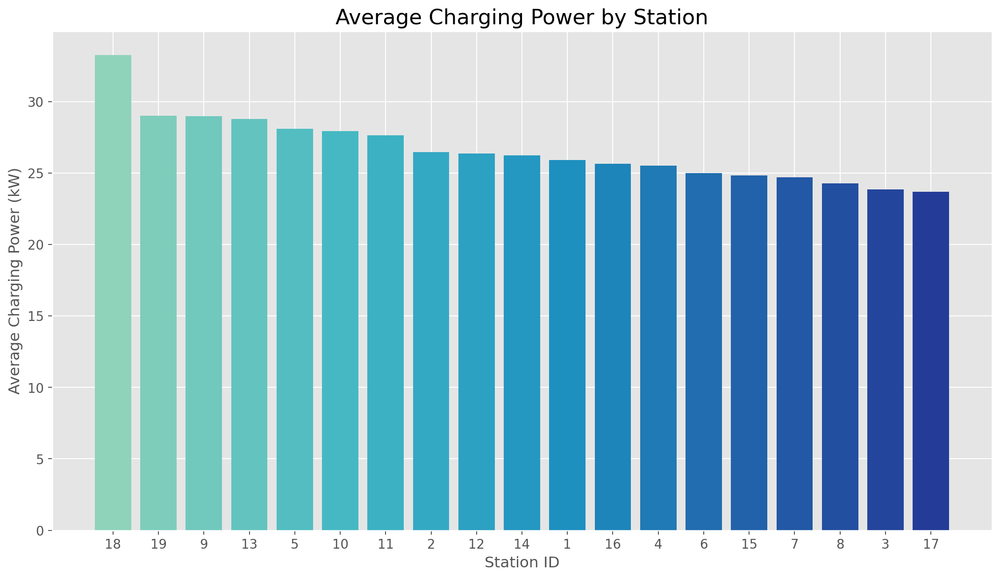
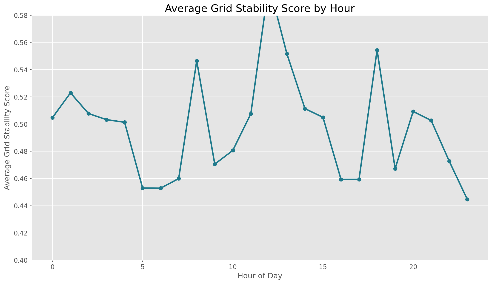
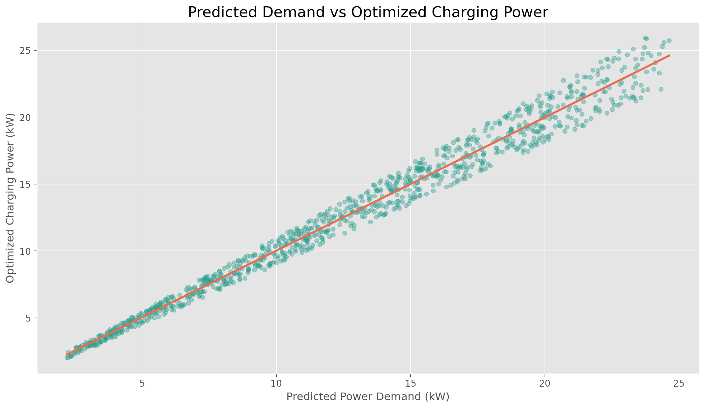
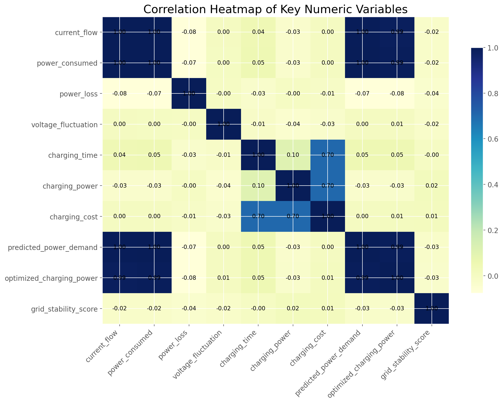
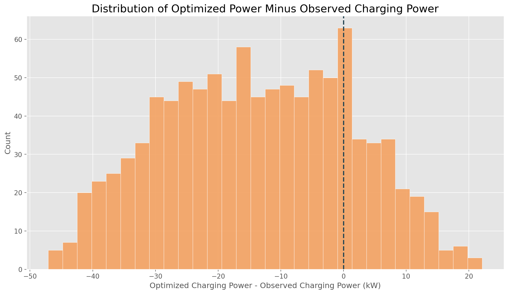
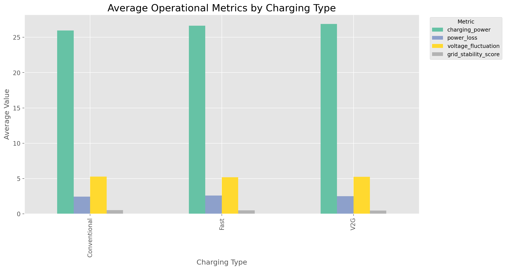

# EV Charging Grid Optimization Dashboard

This project delivers a locally hosted dashboard for exploring and optimizing EV charging power allocation. It uses a predict-then-optimize workflow on `EV_Charging_Grid_Optimization_Categorical.csv` to compare three strategies:

- Observed baseline charging behavior
- The dataset's provided `optimized_charging_power`
- A new explicit optimization routine that reallocates charging power while respecting demand and capacity constraints

The result is an operator-facing dashboard that highlights charging demand, grid conditions, recommended charging actions, and strategy-level tradeoffs between power loss, voltage fluctuation, and grid stability.

## Project Overview

The project is designed as a practical decision support system for EV charging operations. As charging demand grows, power allocation decisions at stations can affect:

- Power loss
- Voltage fluctuation
- Overall grid stability
- Service quality for active EV charging sessions

This implementation uses historical operational data to train explainable predictive models, then applies a constrained optimization routine to recommend charging allocations that improve system behavior without ignoring user demand.

## Dataset

Source file:

- `EV_Charging_Grid_Optimization_Categorical.csv`

The dataset contains 1,000 charging-session records with time, station, electrical, demand, and optimization-related attributes.

### Key Columns

- `timestamp`: 15-minute time interval for the charging session
- `station_id`: charging station identifier
- `location`: urban, suburban, or rural station setting
- `charging_type`: conventional, fast, or V2G charging
- `num_chargers`: number of chargers available at the station
- `voltage_level`: measured voltage
- `current_flow`: measured electrical current
- `power_consumed`: observed power usage
- `power_loss`: observed power loss
- `voltage_fluctuation`: observed voltage fluctuation
- `ev_id`: vehicle/session identifier
- `battery_capacity`: battery size for the EV
- `charging_time`: session charging duration
- `charging_power`: observed charging power
- `charging_cost`: charging cost
- `predicted_power_demand`: projected power demand used as the optimizer's target demand signal
- `optimized_charging_power`: provided optimized charging target from the dataset, used here as a benchmark policy
- `grid_stability_score`: operational stability indicator
- `reduced_power_loss_category`: categorical loss outcome
- `voltage_stability_category`: categorical stability outcome

## Exploratory Data Analysis (EDA)

Before building the dashboard and optimization flow, I explored the dataset to understand its structure, balance, and operational patterns.

### Dataset Shape and Coverage

- The dataset contains `1,000` rows and `21` columns
- The timestamp range runs from `2024-01-01 00:00:00` to `2024-01-11 09:45:00`
- There are `1,000` unique timestamps
- There are `19` unique charging stations
- There are `893` unique EV IDs

Important observation:

- Each timestamp appears only once in the dataset on average, so the data behaves more like a sequence of individual session snapshots than a multi-session grid state with many simultaneous records per time interval

This matters because the dashboard still presents timestamp-based decision-making, but the underlying dataset is sparse at the exact timestamp level.

### Category Balance

The main categorical variables are fairly balanced:

- `location`
  - Urban: `343`
  - Suburban: `336`
  - Rural: `321`
- `charging_type`
  - Fast: `352`
  - Conventional: `331`
  - V2G: `317`
- `num_chargers`
  - Values range from `2` to `9`, with a relatively even spread

The classification-style target columns are also reasonably balanced:

- `reduced_power_loss_category`
  - Medium: `374`
  - Low: `370`
  - High: `256`
- `voltage_stability_category`
  - Moderate: `404`
  - Excellent: `351`
  - Poor: `245`

This balance is helpful because it reduces the risk that the dashboard or predictive models are being driven by one dominant category.

### Numeric Distributions

Key numerical patterns from the dataset:

- Mean observed `charging_power`: `26.490`
- Mean `predicted_power_demand`: `12.784`
- Mean `optimized_charging_power`: `12.794`
- Mean `power_loss`: `2.512`
- Mean `voltage_fluctuation`: `5.235`
- Mean `grid_stability_score`: `0.498`

Selected ranges:

- `charging_power` ranges from `3.009` to `49.976`
- `predicted_power_demand` ranges from `2.196` to `24.634`
- `optimized_charging_power` ranges from `2.028` to `25.918`
- `grid_stability_score` ranges from `0.000` to `0.999`

One of the clearest findings is that observed charging power is much higher than both predicted demand and the provided optimized charging target on average. This supports the project motivation: there appears to be room to reduce allocated charging power while still staying close to demand requirements.

### Station-Level Patterns

Average charging power varies noticeably by station.

Stations with the highest average charging power:

- Station `18`: `33.264`
- Station `19`: `28.994`
- Station `9`: `28.978`
- Station `13`: `28.788`
- Station `5`: `28.080`

Stations with the lowest average charging power:

- Station `15`: `24.834`
- Station `7`: `24.685`
- Station `8`: `24.281`
- Station `3`: `23.850`
- Station `17`: `23.689`

This variation suggests that station-level context matters and supports using station-specific filters and capacity logic in the dashboard.

### Time-Based Patterns

Hourly averages show that demand and optimization targets remain fairly stable across the day, while grid stability varies more.

Examples:

- At hour `5`, average grid stability is relatively low at `0.453`
- At hour `18`, average grid stability is relatively high at `0.554`
- Predicted demand is generally in the `11.3` to `14.1` range across hours
- Optimized charging power closely tracks predicted demand throughout the day

This suggests that demand alone does not fully explain grid quality. Grid stability appears to be influenced by additional operating conditions, which supports the need for a multi-objective optimization view rather than a demand-only allocation rule.

### Location and Charging-Type Patterns

By location:

- Rural stations have the highest average charging power: `27.246`
- Suburban stations have the highest average grid stability: `0.511`
- Urban stations have the lowest average grid stability: `0.484`
- Urban stations also show the lowest average power loss among the three location groups: `2.466`

By charging type:

- V2G sessions have the highest average charging power: `26.877`
- Conventional sessions have the highest average grid stability: `0.520`
- Fast charging has the highest average power loss: `2.591`

These differences justify the dashboard filters for location and charging type because the system behavior changes meaningfully across these segments.

### Correlation Insights

The strongest relationships with `optimized_charging_power` are:

- `predicted_power_demand`: `0.991`
- `power_consumed`: `0.990`
- `current_flow`: `0.986`

Much weaker relationships appear with:

- `grid_stability_score`: `-0.028`
- `charging_power`: `-0.030`
- `power_loss`: `-0.076`

Main takeaway:

- The provided optimized charging target is almost entirely aligned with the demand and electrical load side of the data, not strongly with grid stability directly

This reinforces the value of the dashboard's explicit optimization layer, which tries to balance demand satisfaction with broader grid outcomes instead of simply mimicking one column.

### Baseline vs Optimized Target

The provided optimized target differs substantially from observed charging behavior:

- Mean difference between `optimized_charging_power` and observed `charging_power`: `-13.696`
- Median difference: `-13.678`
- The optimized target is greater than observed charging power in only `20.1%` of rows
- The optimized target stays within `20%` of predicted demand in `100%` of rows

This is one of the most important EDA results in the project:

- The provided optimized policy behaves like a demand-aligned allocation rule
- The observed baseline appears systematically higher than what the optimization-oriented columns suggest is necessary
- This creates a clear analytical reason to compare baseline charging against optimization-based alternatives in the dashboard

### EDA Summary

The exploratory analysis supports the overall project design:

- The data is balanced enough to support meaningful filtering by location and charging type
- Station-level differences are large enough to justify station-aware recommendations
- Observed charging power is much higher than both predicted demand and the dataset's optimized target
- The optimized target closely follows demand, which provides a useful benchmark
- Grid stability varies independently enough that a dedicated optimization layer remains worthwhile

These findings directly motivate the dashboard design, the KPI comparison row, the session-level recommendation table, and the strategy comparison analytics.

### EDA Charts

The following charts were created from the dataset and included as part of the exploratory analysis.

#### 1. Average Charging Power by Station

This chart highlights how average observed charging power varies across stations and supports the station-specific nature of the dashboard recommendations.



#### 2. Grid Stability Score by Hour

This chart shows that grid stability changes across the day, which supports using time-aware monitoring and optimization rather than a single fixed charging rule.



#### 3. Predicted Demand vs Optimized Charging Power

This scatter plot shows the very strong alignment between predicted demand and the dataset's optimized charging target, reinforcing the idea that the provided optimized column behaves like a demand-driven benchmark policy.



#### 4. Correlation Heatmap

This heatmap summarizes how the key numeric variables relate to each other. It makes it easy to see that `optimized_charging_power` is strongly tied to demand and load variables, while `grid_stability_score` is comparatively weakly related.



#### 5. Delta Histogram for Optimized vs Observed Charging Power

This histogram visualizes `optimized_charging_power - charging_power`. Most of the distribution lies below zero, which supports the finding that the observed baseline is usually higher than the optimized target.



#### 6. Charging Type Comparison Chart

This grouped bar chart compares `Conventional`, `Fast`, and `V2G` charging on average charging power, power loss, voltage fluctuation, and grid stability score. It helps explain why charging-type filters are useful in the dashboard.



Together, these visuals make the main EDA patterns easier to understand and directly support the logic used in the dashboard and optimization workflow.

## Solution Architecture

The project follows a simple, explainable pipeline:

1. Load and clean the charging dataset
2. Engineer time-based features from `timestamp`
3. Train linear regression models for:
   - `optimized_charging_power`
   - `power_loss`
   - `voltage_fluctuation`
   - `grid_stability_score`
4. Use the learned relationships to create an explicit optimization problem
5. Solve that optimization problem separately for each timestamp
6. Compare the observed baseline, dataset benchmark, and explicit optimizer
7. Surface the results in a local dashboard

### Why Linear Models?

This project intentionally favors explainability over model complexity. Linear regression makes it easier to:

- Understand how charging power influences predicted outcomes
- Keep the optimization routine transparent
- Defend the methodology in a class setting
- Maintain a clean link between prediction and optimization

## Optimization Logic

The optimizer works at the timestamp level. For each timestamp, it determines recommended charging power allocations for all active charging sessions.

### Mathematical Formulation

#### Sets and Indices

- \( i \in \mathcal{I}_t \): charging sessions active in time period \( t \)
- \( s \in \mathcal{S} \): charging stations
- \( \mathcal{I}_s \subseteq \mathcal{I}_t \): set of charging sessions assigned to station \( s \)

#### Decision Variable

For each charging session \( i \) at time period \( t \), the decision variable is:

\[
x_i = \text{charging power allocated to EV session } i
\]

where:

- \( x_i \geq 0 \)
- \( x_i \) is measured in kilowatts

In the implementation, this optimized value is stored as `explicit_optimized_power`.

#### Parameters

- \( d_i \): predicted power demand for session \( i \)
- \( C_s \): estimated capacity of station \( s \)
- \( \underline{\alpha} = 0.8 \): minimum demand satisfaction fraction
- \( \overline{\alpha} = 1.2 \): maximum demand allocation fraction
- \( U_i \): session-specific upper bound proxy

The optimization also uses learned regression coefficients from the predictive models:

- \( a_{\text{loss}} \): coefficient of charging power in the power-loss model
- \( a_{\text{volt}} \): coefficient of charging power in the voltage-fluctuation model
- \( a_{\text{grid}} \): coefficient of charging power in the grid-stability model

The default objective weights are:

- \( w_{\text{loss}} = 0.45 \)
- \( w_{\text{volt}} = 0.35 \)
- \( w_{\text{grid}} = 0.20 \)

#### Objective Function

The model minimizes a weighted combination of predicted power loss, predicted voltage fluctuation, and negative grid stability:

\[
\min \sum_{i \in \mathcal{I}_t}
\left(
w_{\text{loss}} a_{\text{loss}}
+ w_{\text{volt}} a_{\text{volt}}
- w_{\text{grid}} a_{\text{grid}}
\right) x_i
\]

This objective reflects three goals:

1. Minimize predicted power loss
2. Minimize predicted voltage fluctuation
3. Maximize predicted grid stability

Since the optimizer is solved as a linear program, the learned effect of charging power on each outcome is represented using the corresponding linear regression coefficient.

#### Constraints

##### 1. Demand Satisfaction Constraint

The total allocated charging power in a time period must meet the total predicted charging demand:

\[
\sum_{i \in \mathcal{I}_t} x_i = \sum_{i \in \mathcal{I}_t} d_i
\]

In practice, the implementation clips the total demand target when necessary so that the problem remains feasible under all lower and upper bounds.

##### 2. Minimum Allocation per Session

Each session must receive at least 80% of its predicted power demand:

\[
x_i \geq \underline{\alpha} d_i
\qquad \forall i \in \mathcal{I}_t
\]

With the current parameter setting:

\[
x_i \geq 0.8 d_i
\qquad \forall i \in \mathcal{I}_t
\]

##### 3. Maximum Allocation per Session

Each session can receive at most 120% of its predicted demand, subject to a session-level and station-level cap:

\[
x_i \leq \min \left( \overline{\alpha} d_i,\; U_i,\; C_{s(i)} \right)
\qquad \forall i \in \mathcal{I}_t
\]

With the current parameter setting:

\[
x_i \leq \min \left( 1.2 d_i,\; U_i,\; C_{s(i)} \right)
\qquad \forall i \in \mathcal{I}_t
\]

where:

- \( U_i \) is the session upper-bound proxy
- \( C_{s(i)} \) is the capacity of the station assigned to session \( i \)

##### 4. Station Capacity Constraint

For each station, the total allocated charging power must not exceed the station capacity:

\[
\sum_{i \in \mathcal{I}_s} x_i \leq C_s
\qquad \forall s \in \mathcal{S}
\]

The station capacity \( C_s \) is estimated from the historical 95th percentile of observed charging power at that station.

##### 5. Non-Negativity Constraint

Charging allocations must remain non-negative:

\[
x_i \geq 0
\qquad \forall i \in \mathcal{I}_t
\]

#### Complete Model

The complete optimization model can be written as:

\[
\min \sum_{i \in \mathcal{I}_t}
\left(
w_{\text{loss}} a_{\text{loss}}
+ w_{\text{volt}} a_{\text{volt}}
- w_{\text{grid}} a_{\text{grid}}
\right) x_i
\]

subject to:

\[
\sum_{i \in \mathcal{I}_t} x_i = \sum_{i \in \mathcal{I}_t} d_i
\]

\[
x_i \geq 0.8 d_i
\qquad \forall i \in \mathcal{I}_t
\]

\[
x_i \leq \min \left( 1.2 d_i,\; U_i,\; C_{s(i)} \right)
\qquad \forall i \in \mathcal{I}_t
\]

\[
\sum_{i \in \mathcal{I}_s} x_i \leq C_s
\qquad \forall s \in \mathcal{S}
\]

\[
x_i \geq 0
\qquad \forall i \in \mathcal{I}_t
\]

#### Interpretation

The optimization allocates charging power across active EV sessions so that:

- predicted demand is satisfied
- over-allocation is controlled
- station capacity limits are respected
- grid stress indicators are improved

The objective function combines engineering and operational goals into one weighted decision rule. The default weights emphasize reducing power loss the most, followed by reducing voltage fluctuation, while still rewarding improved grid stability.

#### Practical Note on the Dataset

Although the model is written in general multi-session form, the current dataset contains approximately one row per timestamp on average. As a result, the mathematical formulation allows multiple simultaneous charging decisions, but the available data often behaves more like a sequence of single-session optimization problems.

This should be acknowledged when interpreting results in a report: the formulation is valid, but the dataset structure limits the practical amount of within-timestamp power redistribution.

### Sensitivity Analysis

Because this is a multi-objective optimizer, the recommended charging allocations depend on the relative weights assigned to:

- `power_loss`
- `voltage_fluctuation`
- `grid_stability`

To test robustness, the project runs a sensitivity analysis over multiple weight scenarios:

- `default`: `(0.45, 0.35, 0.20)`
- `loss_plus_small`: `(0.50, 0.30, 0.20)`
- `voltage_plus_small`: `(0.40, 0.40, 0.20)`
- `stability_plus_small`: `(0.40, 0.30, 0.30)`
- `loss_minus_small`: `(0.40, 0.40, 0.20)`
- `voltage_minus_small`: `(0.50, 0.25, 0.25)`
- `stability_minus_small`: `(0.50, 0.35, 0.15)`
- `balanced_equal`: `(0.34, 0.33, 0.33)`
- `loss_heavy`: `(0.60, 0.25, 0.15)`
- `voltage_heavy`: `(0.25, 0.60, 0.15)`
- `stability_heavy`: `(0.25, 0.25, 0.50)`

Each scenario is compared against the default optimization result using:

- `action_flip_rate`: share of rows where the recommendation category changes
- `direction_flip_rate`: share of rows where the direction of the recommendation changes
- `mean_absolute_power_shift`: average change in optimized charging power relative to default
- `max_absolute_power_shift`: maximum change in optimized charging power relative to default
- `station_rank_change`: average shift in station ranking by total optimized power
- predicted outcome deltas for:
  - average power loss
  - average voltage fluctuation
  - average grid stability score
- `feasibility_rate`: share of results that remain feasible

The project uses a balanced stability rule:

- A scenario is labeled `Stable` when:
  - `action_flip_rate < 0.10`
  - `mean_absolute_power_shift < 0.75`
  - `feasibility_rate = 1.0`
- Otherwise it is labeled `Sensitive`

The optimizer is labeled:

- `Reasonably stable` if fewer than 3 small-perturbation scenarios are sensitive
- `Potentially unstable` if 3 or more small-perturbation scenarios are sensitive

How to interpret this:

- `Reasonably stable` means small changes to the objective weights do not materially change recommendations
- `Potentially unstable` means recommendations shift noticeably even when the weights are only adjusted slightly, so the results should be presented with caution

## Dashboard Features

The app is implemented as a local Streamlit dashboard.

### 1. Top Control Bar

The control bar lets you interact with the scenario and the operating context:

- Timestamp selector
- Station filter
- Location filter
- Charging type filter
- Scenario toggle:
  - Observed Baseline
  - Dataset Optimized
  - Explicit Optimizer
- Run Optimization button

What this section explains:

- Which operating snapshot you are currently analyzing
- Whether you are looking at the real observed charging behavior, the dataset-provided optimized policy, or the new explicit optimizer
- How recommendations change when you narrow the view to a specific station, location type, or charging type

This section is the starting point for the whole dashboard. Every chart, table, and metric below updates based on these controls.

### 2. KPI Summary Row

This section provides a fast snapshot of performance:

- Total charging demand
- Allocated charging power
- Predicted power loss
- Voltage fluctuation
- Grid stability score

What this section explains:

- Whether the selected strategy is meeting charging demand
- Whether the recommended allocation is using more or less power than the observed baseline
- Whether the strategy appears to improve grid conditions by lowering predicted loss and fluctuation
- Whether overall grid stability is improving or declining

This is the quickest way to judge if the optimizer is helping. A reader should be able to glance at this row and immediately understand whether the current scenario is operationally better or worse than baseline behavior.

### 3. Station and Session Overview

This table shows active sessions for the selected timestamp, including:

- EV ID
- Station ID
- Location
- Charging type
- Predicted demand
- Observed charging power
- Dataset optimized charging power
- Explicit optimizer recommendation
- Recommended action status

What this section explains:

- Which EV charging sessions are being adjusted
- How much each session differs from the observed baseline
- Whether the optimizer wants to increase power, reduce power, or leave a session close to its current state
- Which types of stations or charging sessions are receiving priority under the selected scenario

This section turns the optimization into concrete actions. Instead of only showing aggregate metrics, it reveals the session-level decisions behind the dashboard's recommendations.

### 4. Grid Condition Panel

This view highlights:

- A grid stability gauge
- Side-by-side comparison for power loss
- Side-by-side comparison for voltage fluctuation

What this section explains:

- The current health of the grid under the selected strategy
- Whether the selected charging allocation is improving stability relative to the baseline
- Whether the tradeoff between charging demand and electrical performance is favorable

This section is mean t to answer the core project question: does changing charging power allocation actually improve grid behavior?

### 5. Recommendation Panel

This section summarizes the most important operator actions, such as:

- Which sessions should reduce power
- Which sessions should increase power
- Which stations are operating close to their estimated capacity

What this section explains:

- The highest-priority decisions an operator should take right now
- Where the optimizer sees excess load or available flexibility
- Which stations may become bottlenecks because they are near their estimated capacity limits

This is the most action-oriented part of the interface. It translates the optimization output into short, operational instructions that a user can understand without reading raw model results.

### 6. Analytics Section

The dashboard includes three analytics tabs:

- `Strategy Comparison`
  - Comparison table across all strategies
  - Allocated power trends over time
- `Demand & Capacity Insights`
  - Station-level average power allocation
  - Demand heatmap by hour and station
- `Model Insights`
  - Model error metrics
  - High-level assumptions behind the optimization pipeline
- `Sensitivity Analysis`
  - Weight-scenario comparison table
  - Action-flip bar chart
  - Mean power-shift bar chart
  - Overall optimizer stability summary

What this section explains:

- `Strategy Comparison`
  - Which of the three strategies performs best overall
  - How the baseline, dataset benchmark, and explicit optimizer compare on power loss, fluctuation, and stability
  - Whether the optimizer's advantages hold across the full dataset rather than only at one timestamp

- `Demand & Capacity Insights`
  - Which stations tend to carry more charging load
  - How demand changes throughout the day
  - Where capacity pressure is concentrated across stations and time periods

- `Model Insights`
  - How well the predictive models are performing
  - Which assumptions support the optimization routine
  - Why the dashboard can produce recommendations from the available data

- `Sensitivity Analysis`
  - Whether the optimizer is robust to small changes in the objective weights
  - Which weight scenarios materially change charging recommendations
  - Whether the current optimization setup should be presented as stable or potentially unstable

This final section helps the reader move from operational monitoring to deeper analysis. It explains the broader system behavior, supports the validity of the optimization approach, and gives the project a stronger analytical narrative.

## Project Structure

```text
433-final-project/
├── app.py
├── README.md
├── requirements.txt
├── EV_Charging_Grid_Optimization_Categorical.csv
└── ev_dashboard/
    ├── __init__.py
    └── pipeline.py
```

## Installation and Local Setup

Python 3.9 or newer is recommended.

### Before You Start

Make sure these files are all in the same project folder:

- `app.py`
- `requirements.txt`
- `EV_Charging_Grid_Optimization_Categorical.csv`
- `ev_dashboard/`

If the CSV file is missing or moved to a different folder, the dashboard will not start correctly.

### Step 1: Open a terminal in the project folder

In your terminal, move into the project directory:

```bash
cd /path/to/433-final-project
```

If you are already inside the folder, you can skip this step.

### Step 2: Create a virtual environment

This keeps the project dependencies separate from the rest of your machine:

```bash
python3 -m venv .venv
```

### Step 3: Activate the virtual environment

On macOS or Linux:

```bash
source .venv/bin/activate
```

On Windows PowerShell:

```powershell
.venv\Scripts\Activate.ps1
```

On Windows Command Prompt:

```cmd
.venv\Scripts\activate
```

After activation, your terminal usually shows something like `(.venv)` at the beginning of the line.

### Step 4: Install the required packages

```bash
pip install -r requirements.txt
```

This installs Streamlit, pandas, scikit-learn, SciPy, Plotly, and the other libraries the dashboard needs.

## Running the Dashboard Locally

### Step 1: Make sure you are still in the project folder

Your terminal should be inside the folder that contains `app.py`.

### Step 2: Make sure the virtual environment is active

If you opened a new terminal window, activate the environment again before running the app.

### Step 3: Start the dashboard

On macOS, run this from the same Terminal window where `(.venv)` is visible:

```bash
streamlit run app.py
```

If that does not work on macOS, use one of these instead:

```bash
python3 -m streamlit run app.py
```

or, if your virtual environment uses `python`:

```bash
python -m streamlit run app.py
```

Keep that Terminal window open while the dashboard is running. To stop the dashboard later, press `Control + C`.

If `streamlit` is not recognized, use:

```bash
python -m streamlit run app.py
```

or:

```bash
python3 -m streamlit run app.py
```

### Step 4: Open the local URL in your browser

After the command runs, Streamlit will print a message in the terminal that looks similar to this:

```text
  Local URL: http://localhost:8501
```

Open that exact URL in your browser.

In most cases, the dashboard will be available at:

```text
http://localhost:8501
```

### What You Should See

When the dashboard opens successfully, you should see:

- The title `EV Charging Grid Optimization Dashboard`
- A control bar with timestamp and filter options
- KPI cards for demand, allocated power, power loss, voltage fluctuation, and grid stability
- A charging session table
- Strategy comparison and analytics sections farther down the page

The first load may take a few seconds because the app trains the models and computes the optimization results.

## Quick Start

If you want the shortest possible version:

```bash
cd /path/to/433-final-project
python3 -m venv .venv
source .venv/bin/activate
pip install -r requirements.txt
streamlit run app.py
```

Then open `http://localhost:8501` in your browser.

## Troubleshooting

### `streamlit: command not found`

Try:

```bash
python3 -m streamlit run app.py
```

### `ModuleNotFoundError`

This usually means the virtual environment is not active or the dependencies were not installed. Run:

```bash
pip install -r requirements.txt
```

### The browser page is blank or never loads

- Wait a few seconds on first launch
- Check the terminal for error messages
- Confirm that `EV_Charging_Grid_Optimization_Categorical.csv` is still in the project root
- Stop the app with `Ctrl+C` and run it again

### Port 8501 is already in use

Run Streamlit on another port:

```bash
streamlit run app.py --server.port 8502
```

Then open:

```text
http://localhost:8502
```

## Internal Interfaces

The project exposes these reusable functions in `ev_dashboard/pipeline.py`:

- `load_data(csv_path)`
- `prepare_features(df)`
- `train_predictive_models(df, metadata)`
- `predict_outcomes(df, metadata, models)`
- `build_station_capacity_map(df)`
- `optimize_timestamp_allocation(group_df, models, capacity_map, weights, bounds_config)`
- `optimize_all_timestamps(df, models, capacity_map, weights, bounds_config)`
- `generate_weight_scenarios()`
- `run_weight_sensitivity_analysis(df, metadata, models, capacity_map, bounds_config)`
- `compare_weight_scenarios(default_df, scenario_results, metadata, models, capacity_map, bounds_config)`
- `evaluate_strategy(df, power_column, metadata, models, capacity_map, bounds_config)`
- `compare_strategies(df, metadata, models, capacity_map, bounds_config)`

These interfaces keep the analysis logic separate from the Streamlit UI and make the project easier to test or extend.

## Evaluation Metrics

The strategy comparison focuses on:

- Average allocated power
- Total allocated power
- Average power loss
- Average voltage fluctuation
- Average grid stability score
- Demand satisfaction rate
- Session-bounds compliance rate
- Station-capacity compliance rate

For sensitivity analysis, the project also tracks:

- Action flip rate
- Direction flip rate
- Mean absolute power shift
- Max absolute power shift
- Station rank change
- Predicted outcome deltas versus the default weight setting
- Feasibility rate across weight scenarios

These metrics help assess whether a charging strategy is efficient, stable, and operationally feasible. Outcome comparisons are generated from the trained predictive models after substituting each strategy's charging power into the feature set.

## Assumptions

- `predicted_power_demand` is treated as the demand forecast the optimizer should satisfy
- `optimized_charging_power` is used as a benchmark policy, not the final optimization answer
- The optimization is solved independently for each timestamp
- Station capacity is estimated from historical data because hardware limits are not explicitly provided
- The project prioritizes interpretability and operational clarity over maximizing model complexity

## Limitations

- The dataset is relatively small, so results should be treated as a proof of concept
- Station capacity is estimated rather than observed directly
- The optimization uses linear surrogate models, which simplifies real grid behavior
- Some electrical variables are treated as fixed context during optimization rather than dynamically recomputed
- The dashboard is intended for local exploration, not production deployment

## Future Improvements

- Replace linear models with stronger predictive models and compare tradeoffs
- Introduce explicit real-time demand forecasting rather than relying on the provided demand column
- Add battery-aware or charger-aware constraints if more infrastructure data becomes available
- Support multi-period optimization instead of solving one timestamp at a time
- Persist recommended plans and export them as reports or CSV files

## Interpreting the Results

When using the dashboard:

- Start with the KPI row to see whether the selected strategy reduces loss and fluctuation while improving stability
- Review the session table to identify which EVs are affected by the optimizer
- Use the recommendation panel to understand the highest-priority actions
- Check the strategy comparison tab to see whether the explicit optimizer improves performance across the full dataset
- Use the model insights tab to understand how the predictive layer supports the optimization logic
